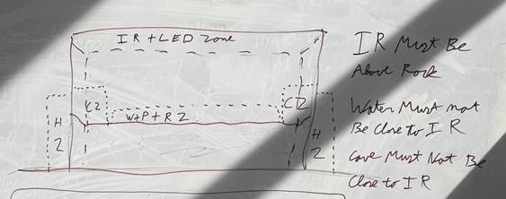
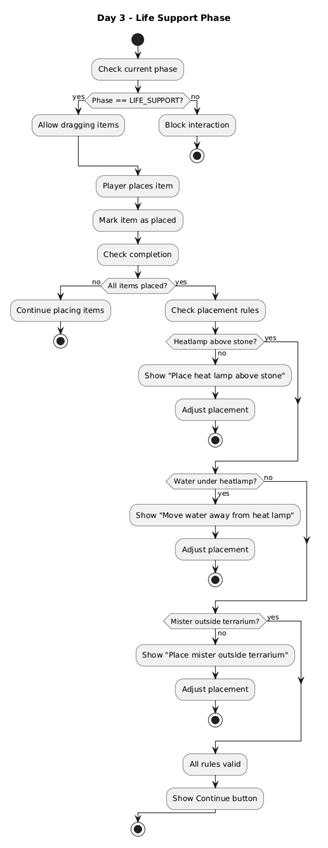

# Devlog: Terrarium elements

> ℹ️ **Note:** Author: Megan

After a meeting with Mariah Healey, an expert in reptile caretaking and
curator of a large online database on reptile care, the decision was
made to remove the petting module and replace it with a terrarium
building system. She identified terrarium setup and feeding as two of
the most common areas where beginner keepers make mistakes.

The enrichment placement was designed to teach the proper elements and
their placement inside a terrarium. The underlying information is based
on the Reptifiles care sheet, used with permission.

## 💡 Concept and Brainstorming

Initially, the game consisted of two modules: petting and feeding. These
were narratively connected by placing the player in the role of an
intern caring for a leopard gecko that already had an established
terrarium.

During a brainstorming session, this concept was revised. The player
still takes on the role of the intern, but now cares for a newly arrived
gecko. The animal is temporarily placed in a quarantine terrarium, and
the player is tasked with both feeding it and building a new,
appropriate habitat.

To structure the learning experience, the content was divided into three
stages, each representing an in-game day:

1.  Preparing the soil

2.  Adding enrichment

3.  Installing life support systems (e.g., a heat lamp)

The enrichment represents the second and third steps in this sequence
and introduces the player to the terrarium building process.

## 1️⃣ First Iteration

The first iteration of the enrichment phase presents a clear and
structured setup. Players see the terrarium as the main workspace, a set
of items (plants, cave, stone) in front, and a checklist on the right
showing what needs to be placed. This makes the goal immediately
understandable and reduces confusion. This design is effective because
it follows basic usability principles. The checklist provides clear
guidance and supports goal-oriented interaction, which helps reduce
cognitive load (as described by Jakob Nielsen). At the same time,
players interact through dragging and placing objects, which is an
example of direct manipulation (Ben Shneiderman). This makes the system
intuitive and easy to learn. The layout also separates tasks clearly:
the terrarium is where you act, the items are your tools, and the
clipboard shows your goal. Combined with familiar real-world objects,
this supports quick understanding without needing much explanation.
Overall, this iteration works well because it is simple, clear, and
allows players to explore without strict rules, making it a strong
introduction to the enrichment system.

## 🔍 Playtest Observations

The feedback shows that players sometimes feel confused during the
terrarium builder enrichment and life support phases. Placing items like
the heat lamp, cave, or mister is not intuitive, and objects behave in
unrealistic ways, which breaks immersion. The building process can feel
repetitive, as players think they have to place everything each time,
and the game does not clearly show whether their setup is correct or
not. In general, guidance and feedback are lacking, making it hard to
learn where to place items.

## ✅ Final Iteration

Based on the playtest feedback, the placement system was improved to be
clearer and easier to understand. New placement rules were added and
visualized so players can better see what is correct and what is not.
One of the biggest issues was the mister placement. To fix this, a mat
with a mister icon is now placed next to the terrarium, clearly showing
where it belongs. For other objects, visual feedback was added: the
water turns red if it is placed under the heat lamp, the heat lamp turns
red if it is not above the stone, and the mister turns red if it is
inside the terrarium. This helps players immediately see mistakes while
placing items. The interaction itself was also improved. Hitboxes were
refined to make placing and adjusting items easier and less frustrating.
In addition, the layering of objects was updated to feel more natural,
so items appear in a more logical order (for example, the LED behind the
heat lamp, and caves behind stones and plants). Finally, placeholder
visuals were replaced with proper art assets, making the overall
experience more consistent and polished.

## 🔧 Implementation Details

On Day 3, the Life Support phase works in three simple steps.

### 1️⃣ Step 1: Control Item Placement

First, the game controls **when you are allowed to place items**. You
can only drag and place life support objects (water, LED, heat lamp,
mister) when the game is in the Life Support phase.

### 2️⃣ Step 2: Track Placed Items

Second, the game **tracks what you have placed**. Every time you drop an
item into the terrarium, the system marks it as placed. This works
either through specific placement zones or by checking if the item
overlaps enough with the terrarium area.

### 3️⃣ Step 3: Check Completion

Third, after every placement, the game **checks if you are done**. It
does this in two stages:

- It first checks if all required items are placed.

- If they are, it then checks if the placement is correct.

There are three important rules for correct placement:

- The **heat lamp must be above or aligned with the stone**.

- The **water must not be directly under the heat lamp**.

- The **mister must be placed outside the terrarium.**

If any of these rules are broken, the player gets feedback and must
adjust the setup. If everything is correct, the game allows the player
to continue.

While placing items, the game also gives **instant visual feedback** by
highlighting wrong placements (for example, turning them red).

You might wonder why there are multiple checks. The reason is that they
serve different purposes:

- The **“all items placed” check** only ensures that nothing is missing.

- The **rule checks** make sure the setup is actually correct and makes
  sense.

So even if everything is placed, it can still be wrong. Some checks may
seem unnecessary, especially if earlier phases already guaranteed
certain conditions (like having a cave or plant). However, they are kept
as a safety measure. This helps prevent bugs, handles unexpected
situations, and makes the system more flexible if the game changes
later.

