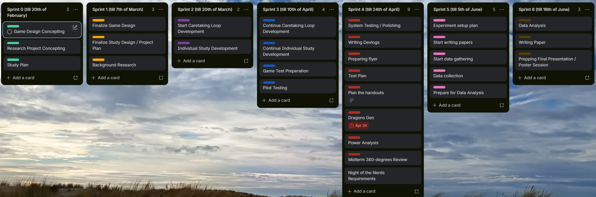

# Trello (Scrum)

## 💡 Why Trello

Trello was used to run the project as a series of two-week Scrum
sprints, with one board tracking sprint goals from project kickoff
through to the final presentation. Each list represents one sprint,
labeled with its end date, and each card represents a goal or task for
that sprint.

## 🗂️ Sprint Overview

| Sprint | Period | Goals |
|----|----|----|
| Sprint 0 | until Feb 20 | Game Design Concepting, Research Project Concepting, Study Plan |
| Sprint 1 | until Mar 7 | Finalize Game Design, Finalize Study Design / Project Plan, Background Research |
| Sprint 2 | until Mar 20 | Start Caretaking Loop Development, Individual Study Development |
| Sprint 3 | until Apr 10 | Continue Caretaking Loop Development, Continue Individual Study Development, Game Test Preparation, Pilot Testing |
| Sprint 4 | until Apr 24 | System Testing / Polishing, Writing Devlogs, Preparing Flyer, Test Plan, Plan the Handouts, Dragons Den (Apr 24), Power Analysis, Midterm 360-degree Review, Night of the Nerds Requirements |
| Sprint 5 | until Jun 5 | Experiment Setup Plan, Start Writing Papers, Start Data Gathering, Data Collection, Prepare for Data Analysis |
| Sprint 6 | until Jun 16 | Data Analysis, Writing Paper, Prepping Final Presentation / Poster Session |

## 📈 Reading the Board

The sprint cadence shows a clear shift in focus over the course of the
project: early sprints (0-2) centered on concepting, study design, and
background research; the middle sprints (2-4) carried the bulk of game
and study development alongside test preparation; and the final
sprints (5-6) shifted entirely to data collection, statistical
analysis, and writeup. Sprint 4 is the busiest, reflecting the overlap
between finishing development, running pilot/system tests, and
preparing for the Night of the Nerds and Dragons Den milestones at the
same time.

