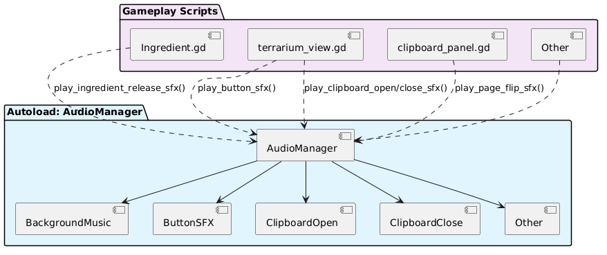

# Devlog: Audio Management

> ℹ️ **Note:** Author: Megan

## ⚠️ The Problem

At the start of Sprint 2, no structured audio system had been
implemented in the Scaly Sanctuary prototype. Sound effects and
background music were not yet integrated into gameplay, and no framework
existed to manage audio consistently. Rather than modifying an existing
system, a new solution had to be designed from the ground up.\
A balance needed to be achieved between simplicity and flexibility. The
system was required to be easy to use and introduce minimal complexity,
while still allowing for future extensions such as volume control,
additional sound effects, and more advanced audio features.\
Without an early structured approach, there was a risk that audio logic
would later be implemented in a scattered and inconsistent manner. This
could have led to reduced maintainability and limited scalability. To
prevent this, a centralized and extendable audio system was defined as a
requirement from the beginning.

## 🔍 Research

Best practices for audio management in [Godot](Godot_851969.md) 4 were investigated using
community tutorials and documentation. The following resources were
used:

- [https://www.youtube.com/watch?v=Egf2jgET3nQ&t=339s&pp=ygULZ29kb3QgYXVkaW8%3D](https://www.youtube.com/watch?v=Egf2jgET3nQ&t=339s&pp=ygULZ29kb3QgYXVkaW8%3D)
  Overview of core audio setup and AudioStreamPlayer usage

- [https://www.youtube.com/watch?v=N3p-7iJWRBY&pp=ygULZ29kb3QgYXVkaW8%3D](https://www.youtube.com/watch?v=N3p-7iJWRBY&pp=ygULZ29kb3QgYXVkaW8%3D)
  Explanation of audio buses and mixer structures

- [Implementation of a centralized audio manager system](https://www.youtube.com/watch?v=N1qh3UdXOfY)

From this research, several insights were identified.\
Autoload singletons in Godot persist across scene transitions unless
they are explicitly removed. This makes them suitable for global systems
such as audio management. Non-spatial AudioStreamPlayer nodes were found
to be appropriate for UI sounds and background music, as they are not
affected by camera position. Reliable looping of background music can be
achieved by combining loop settings with fallback mechanisms such as
reconnecting the finished signal.

## 💡 The Solution

Based on these findings, a centralized AudioManager was implemented as
an autoload singleton. This manager is used as the single point of
control for all audio playback in the game. An overview of the system is
shown in Figure 1. Dedicated AudioStreamPlayer nodes are included and
organized by sound category. These categories include background music,
user interface sounds, and gameplay effects.\
Background music is started at launch and configured to loop
continuously, ensuring that it persists across scene transitions. To
maintain responsiveness, a consistent pattern is used for all sound
effects. If a sound is already playing, it is stopped and restarted.
This prevents sounds from being missed during rapid interactions. The
manager is configured with PROCESS MODE ALWAYS, so audio continues even
when the game is paused.\
Interaction with the audio system is handled through simple and clearly
named function calls. This removes the need for gameplay scripts to
directly manage audio resources. As a result, coupling between gameplay
logic and audio is reduced.



## 🍴 Example: Food Crafting SFX

The use of the audio system can be demonstrated with the food crafting
mechanic. When an ingredient is dragged into the crafting bowl, a sound
effect is triggered through the audio manager:

```gdscript
if over_bowl and current_bowl :
current_bowl . add_ingredient_node ( self )
AudioManager . play_ingredient_release_sfx ()
```

When the bowl evaluates the recipe, different sound effects are
triggered depending on the result:

```gdscript
if current_names == required :
AudioManager . play_correct_dish_sfx ()
finish_dish ()
else :
AudioManager . play_wrong_dish_sfx ()
fail_dish ()
```

This pattern is used across multiple interactive systems, such as
ingredient interactions and vet mechanics. A consistent audio behaviour
is therefore achieved. Because the AudioManager is implemented as an
autoload, these function calls work during scene loading, pausing, and
transitions without additional setup.

## 📋 Summary

The introduction of a centralized audio manager has provided the project
with a stable and extensible foundation. Audio handling is now unified
under a single system, eliminating duplication and ensuring consistency
across all scenes. Background music persists reliably, and gameplay
scripts are simplified through the use of high-level function calls.
This architecture also prepares the project for future enhancements.
Features such as global volume controls, audio balancing, and more
advanced systems like spatial audio or integrated dialogue effects can
now be implemented without significant restructuring.
