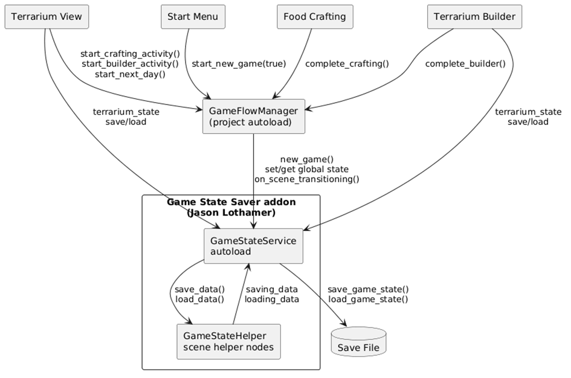

# Devlog: Game State and Flow Management

> ℹ️ **Note:** Author: Megan

## ⚠️ The Problem

Sprint 2 focused on building the core systems for the Scaly Sanctuary
prototype, especially game flow and state management. The goal was to
establish a reliable way to store global state and reapply it across
scenes, support switching between different game versions, and lay the
groundwork for save-file support in the full game. While save files were
not a strict requirement for the prototype, designing with that future
requirement in mind was important to avoid limitations later on.

## 🔍 Research

During this sprint, candidate solutions were evaluated through small
demo projects before integrating anything into the main codebase. The
focus was on testing practical usability, integration effort, and
long-term maintainability.

> ℹ️ **Note:** The Godot Game State Saver Plugin by Jason Lothamer
> (<https://github.com/jhlothamer/godot_game_state_saver_plugin>) became
> the primary reference and eventual foundation for persistence. It
> provided a straightforward pattern for managing both global and
> scene-specific state. This was complemented by a video tutorial on
> saving and loading games
> (<https://www.youtube.com/watch?v=_gBpk5nKyXU>), which helped validate
> implementation details, particularly around correctly wiring saving and
> loading into a Godot project.
>
> An alternative architecture, the Maaack Godot Game Template
> (<https://github.com/Maaack/Godot-Game-Template>), was also explored.
> However, it introduced unnecessary complexity for the prototype and
> would have slowed iteration rather than supporting it.

## 💡 The Solution

The final system separates responsibilities into two cooperating
components. The game flow manager handles progression logic, including
starting new games, switching scenes, advancing time, and controlling
when activities such as crafting or building can occur. Beneath this,
the Game State Saver plugin provides the persistence layer through a
game state service and helper nodes.

The service is responsible for storing global and scene-specific data,
while helper nodes attached to scenes serialize relevant properties and
restore them when the scene is reloaded. During a scene transition, the
flow manager triggers the persistence system before switching scenes:

```gdscript
GameStateService . on_scene_transitioning ()
```

This call ensures that all helpers save their data. Once the new scene
is loaded, the stored state is reapplied and a signal is emitted to
indicate that loading has completed, allowing the scene to perform any
additional setup.

The relationship between these components is shown in Figure 1.



## 🥣 Example: Crafting Bowl Persistence

A concrete example of this system is the crafting bowl handoff between
scenes. After crafting is completed, the game captures the final list of
ingredients in order and stores it. When the player returns to the
terrarium, this list is restored and applied to the bowl, ensuring
visual consistency.

The process begins when crafting is completed. At this point, the
ingredient order is retrieved from the bowl and passed to the flow
manager:

```gdscript
func _on_recipe_completed ( _ingredient_names : Array [ String ]) -> void :
dish_completed = true
bowl_content = bowl . get_ingredient_names ()
GameFlowManager . complete_crafting ( bowl_content )
_update_clipboard_text ()
```

Here, the important step is extracting the ordered ingredient list and
forwarding it. This preserves the exact visual arrangement.

The flow manager then stores this data in the global state:

```gdscript
func complete_crafting ( final_bowl_content : Array [ String ]) -> void :
var crafting_state := get_crafting_state ()
crafting_state [ " completed " ] = true
crafting_state [ " final_bowl_content " ] = final_bowl_content . duplicate
( true )
GameStateService . set_global_state_value (
CRAFTING_STATE_KEY , crafting_state
)
2
update_dish ()
_finalize_activity_completion ()
```

At this stage, the ingredient list is duplicated and written into the
global crafting state. This ensures it persists safely across scene
transitions without unintended mutation.

When returning to the terrarium, the system retrieves this stored state
and decides whether the bowl should be shown and populated:

```gdscript
func _update_food_bowl () -> void :
var crafting_state := GameFlowManager . get_crafting_state ()
var crafting_done := bool ( crafting_state . get ( " completed " , false ) )
if food_bowl :
food_bowl . visible = crafting_done
if crafting_done :
var bowl_content = crafting_state . get ( " final_bowl_content " )
if food_bowl :
_apply_bowl_content_from_state (
bowl_content , ingredient_textures
)
```

This logic ensures that the bowl only appears once crafting has been
completed and that the correct data is used for reconstruction.

Finally, the bowl content is applied slot by slot:

```gdscript
func _apply_bowl_content_from_state (
bowl_content : Array [ String ] ,
ingredient_textures : Dictionary
) -> void :
_ensure_bowl_slots_bound ()
clear_all_slots ()
for i in range ( bowl_content . size () ) :
if i >= bowl_content_slots . size () :
break
var ingredient_name := str ( bowl_content [ i ])
var slot := bowl_content_slots [ i ]
if slot != null and ingredient_textures . has ( ingredient_name ) :
slot . texture = ingredient_textures [ ingredient_name ]
slot . show ()
```

This loop restores each ingredient in order, ensuring that the bowl
appears exactly as it did after crafting. Bounds checks prevent
overflow, and only valid textures are applied.

## 📝 Summary

The system cleanly separates persistence from gameplay logic. The plugin
provides reliable state storage and restoration, while the flow manager
defines how and when that state is used. This results in a flexible
structure that supports consistent scene transitions and can be extended
toward full save-file functionality without major architectural changes.
