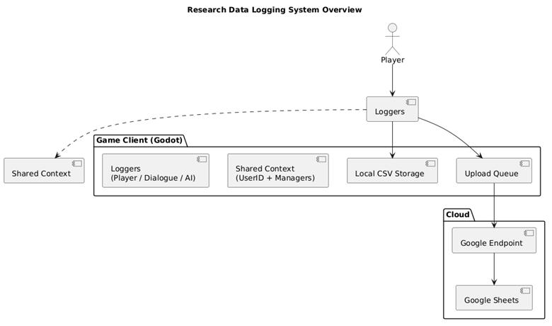
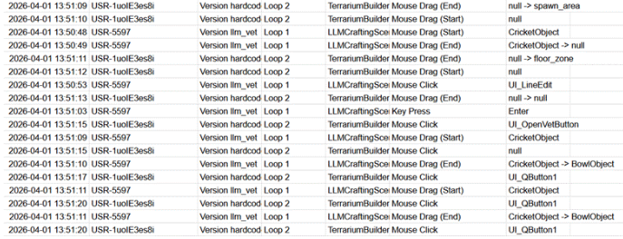

# Devlog: Research Data Logging System

*Created by Megan Spielberg on May 25, 2026*

> ℹ️ **Note:** Author: Valentino
> Analysis & Design:
> [Analysis & Design Document - Research Data Logging.pdf](images/3735560/3211277.pdf)

## ❓ Challenge

How can we capture reliable, cross-referenceable behavioural data from
study participants during live game sessions without disrupting their
experience?

The research study requires objective, timestamped records of what
participants do inside the game: which objects they click, which
dialogue branches they follow, and what they say to the AI-powered NPC.
Relying on manual observation or post-session recall is not feasible for
a study of this kind. The challenge was to build an automatic logging
system inside Godot that writes data both locally and to a central cloud
spreadsheet in real time, while remaining completely invisible to the
player and robust enough to survive network interruptions mid-session.

## ⚙️ Methods

### 📚 Library: Analysis & Design

I researched the "Dual-Write" pattern and "Queue-Based" approaches to
asynchronous HTTP communication. I decided to implement three
independent loggers, each responsible for a distinct data stream: raw
player input interactions, scripted dialogue progression, and full AI
conversation histories. This phase focused on defining a shared base
schema (Timestamp, UserID, GameVersion, Loop, Scene) so that rows from
all three sheets could later be joined and cross-referenced during
analysis.

The full analysis and design document can be found by following the
evidence description.

### 🛠️ Workshop: Prototyping

The logging logic was distributed across three GDScript nodes:
[PlayerDataLogger.gd](http://playerdatalogger.gd/),
hc_Dialogue\_[Logger.gd](http://logger.gd/), and
[AiLogger.gd](http://ailogger.gd/). A shared identity mechanism was
implemented first: on first launch, each logger checks for a user_id.txt
file in the user:// directory. If absent, it generates a pseudonymous
USR-\[10 char\] identifier, writes it to disk, and reuses it for every
subsequent session. Because all three loggers read from the same file
path, every row across all three data sheets for a given participant
carries the same UserID, enabling join operations during analysis.

### 🧪 Lab: Component Test

Each logger was validated by running the game in a local playtesting
session and inspecting both the generated local CSV files and the live
Google Sheet. I verified that rows appeared correctly with all columns
populated, that the UserID was consistent across all three sheets for
the same session, and that the queue did not deadlock when events fired
in rapid succession. The DebugConfig.logging_enabled flag was toggled to
confirm that all three loggers silently suppressed writes during
development builds, preventing test data from contaminating the research
dataset.

## 🎨 Design & Functionality

### 🛢️ The Dual-Write Pipeline

Every log entry follows the same two-step write path regardless of which
logger produces it. First, the entry is appended to a local CSV file
synchronously using FileAccess, ensuring data persistence regardless of
network state. Second, the entry is appended to an in-memory
request_queue, and the cloud upload process is triggered. This means a
network outage during a session can never result in data loss, as the
local file always holds the complete record.

### ☁️ Implementation: The Queue & HTTP Management

Cloud synchronisation is managed by a serial queue to prevent concurrent
HTTP calls. An is_queue_processing boolean acts as a mutex: only one
request can be in-flight at a time. When a request completes, the
callback releases the flag and immediately checks for the next pending
entrmediately checks for the next pending entry.

 

func *process*queue() -\> void:

    if is_queue_processing or
request\_[queue.is](http://queue.is/)\_empty(): return

    is_queue_processing = true

    var row_data = request_queue.pop_front()

    http_request.request(GOOGLE_SCRIPT_URL, headers,
HTTPClient.METHOD_POST, body)

 

In the event of an HTTP error, the queue advances to the next entry
rather than halting. A failed cloud sync does not block subsequent
events from uploading, and the local CSV backup ensures no entry is
permanently lost.

 

3.  **Player Input Detection**

The PlayerDataLogger overrides the *input() callback to intercept all
engine-level input events. It uses a drag threshold of 10.0 pixels to
distinguish a click from a drag, and logs both the drag start and drag
end as separate events. Object identification is handled by a two-stage
lookup: the UI layer is checked first via gui*get_hovered_control(),
then a 2D physics point query is run at the global mouse position for
world-space objects. The query traverses the InteractionAreas node
hierarchy used throughout the game's scene structure to return a
meaningful parent object name rather than a raw collider name.

 

These steps are all visualized in the following figure:

**Results**

**Implementation**

- **Invisible Data Collection:** The player is never presented with any
  logging UI or error messages. All three loggers operate entirely in
  the background as silent Node children.

<!-- -->

- **Persistent Local Backup:** Each logger writes to its own dedicated
  CSV file in the user:// directory (playtest_log.csv,
  HCdialogue_history.csv, ai_conversation_history.csv), meaning session
  data survives even if the cloud sync fails entirely.

<!-- -->

- **Cross-Referenceable Data:** The shared UserID, GameVersion, Loop,
  and Scene columns across all three sheets allow rows to be joined and
  temporally aligned during post-hoc analysis, enabling researchers to
  reconstruct a full picture of any given moment in a participant's
  session.

 

**Validation**

- **Data Consistency:** Component testing confirmed that the UserID was
  identical across all three Google Sheets for the same session,
  validating the shared identity mechanism.

<!-- -->

- **Queue Stability:** Rapid interaction sequences (e.g., clicking
  through multiple objects in quick succession) did not cause queue
  deadlocks or duplicate entries, confirming the mutex pattern is
  sufficient for the expected event rate.

<!-- -->

- **Toggle Integrity:** With DebugConfig.logging_enabled set to false,
  no rows were written to any local file or remote sheet, verifying that
  internal test sessions produce zero contamination of the research
  dataset.

 

Whenever a log entry is created, it is written locally first and then
queued for cloud upload:

 

\[Local CSV write: always synchronous\]

entry appended to request_queue

\>\> Cloud sync attempt via Google Apps Script endpoint

\>\> On failure: queue advances, local copy retained

 

Now when the data is logged, it looks like the following:

**Next Steps**

The next step would be to deploy the data logging system into the game
conditions to prepare for data collection.

This leads to making a plan and setting up the data analysis, in order
to aggregate this raw data into usable insights and conclusions.
