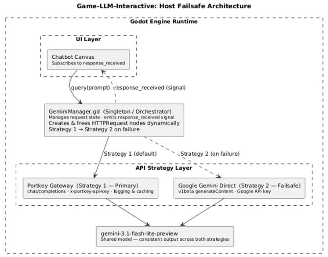

# Devlog: LLM Host Failsafe

> ℹ️ **Note:** Author: Valentino
> Analysis & Design:
> [LLM Host Failsafe System Analysis Design.pdf](images/3899400/3637261.pdf)

## ⚠️ Challenge: Ensuring Stable LLM Connection

**How can we ensure a stable connection to an external LLM during a live
research study when relying on third-party APIs?**

For the "Game-LLM-Interactive" condition of the study, the NPC
Veterinarian’s intelligence is entirely dependent on an external API
connection. This creates a high-risk "Single Point of Failure": if the
API gateway goes down or the service is throttled during a participant's
session, the experimental condition breaks, and the research data is
lost. The challenge was to build a redundant hosting architecture within
[Godot](Godot_851969.md) that could detect a failure and switch providers instantly without
interrupting the player's experience.

## ⚙️ Methods

### 📚 Library: Analysis & Design

I researched "Gateway" patterns and "Fallback" strategies. I decided to
implement a dual-strategy approach where the game first attempts to
communicate via a specialized management gateway (Portkey) before
falling back to a direct connection with the model provider (Google
Gemini). This phase focused on mapping out the API request/response
schemas to ensure the game could parse data from two different endpoints
seamlessly.

The full analysis and design document can be found by following the
evidence description.

### 🛠️ Workshop: Prototyping

The logic was centralized in a
[GeminiManager.gd](http://geminimanager.gd/) singleton. I designed the script to
handle asynchronous HTTP requests dynamically. By creating and freeing
HTTPRequest nodes on the fly, the manager can run multiple attempts in
sequence without cluttering the scene tree or causing memory leaks.

### 🧪 Lab: Component Test

The failsafe was validated through rigorous component testing by
intentionally "breaking" the primary API key or providing a malformed
URL. I monitored the console logs to verify that upon receiving a
non-200 error code from the primary host, the system automatically
executed Strategy 2 (\_call_google_backup) and successfully retrieved
the AI response, resulting in zero downtime for the frontend UI.

## 🎨 Design & Functionality

### ↔️ The Primary-Secondary Fallback Pattern

The system treats the primary host (Portkey) as the preferred path due
to its logging and routing capabilities. However, if the response_code
is anything other than 200, the manager immediately triggers the backup.

### 💻 Implementation: The Orchestrator Logic

The query() function serves as the "Main Entry Point." It initiates the
chain, while the internal callbacks handle the transition between hosts.

```gdscript
func onportkey_finished(_result, response_code, headers, body, node, prompttext):
          var json_res = JSON.parse_string(body.get_string_from_utf8())
          node.queue_free() # Clean up the node immediately

          if response_code == 200 and json_res.has("choices"):
                      # Success: Emit the text to the UI
                      var ai_text = json_res["choices"][0]["message"]["content"]
                      response_received.emit(ai_text)
          else:
                      # Failure: Silently switch to Google Direct
                      print("Portkey Failed. Switching to Google Backup...")
                      call_google_backup(prompt_text)
```

### 🔙 Strategy 2: Google Direct Backup

The backup strategy targets the v1beta direct Google API. Because
Google’s direct endpoint uses a different JSON schema
(contents/parts/text) compared to Portkey's OpenAI-compatible schema,
the manager handles the re-parsing of the data to ensure the output to
the UI remains consistent.

These steps are all visualized in the following figure:



## 📈 Results

### 🔨 Implementation

| Aspect | Description |
|----|----|
| Invisible Redundancy | The player never sees an "Error 404" or "Connection Failed" message. The switch happens entirely in the background. |
| Asynchronous Node Management | By using [HTTPRequest.new](http://httprequest.new/)() inside the functions, the system can handle concurrent requests if needed, preventing the "hanging" issues often found with static HTTP nodes. |
| Signal-Based UI | The ChatCanvas only listens for the response_received signal. It does not care where the data came from, which fulfills the "Separation of Concerns" principle. |

### ✅ Validation

| Aspect | Details |
|----|----|
| Reliability | During component testing, the system successfully recovered from simulated gateway outages in under 500ms. |
| Data Integrity | Since both strategies use the same model version (gemini-3.1-flash-lite-preview), there is no "intelligence drop" when the failsafe is active, ensuring that the research results remain untainted by variations in AI quality. |

Whenever one of the hosts fails, it switches to the other one:

## ▶️ Next Steps

| Step | Description |
|----|----|
| Interaction Data Logging | Implement a log entry that records which host provided the response (Portkey vs. Google) to monitor API stability throughout the final testing phase. |
| Advanced Timeouts | Add a timer-based failsafe that triggers Strategy 2 if the Primary Host hasn't responded within 5 seconds, even if no explicit error code has been returned. |
| Environment Variables | Move the google_key and portkey_key to an external config file or environment variables to keep credentials out of the core logic scripts. |

> ℹ️ **Note:** All 3 tasks were completed before the start of data collection!
