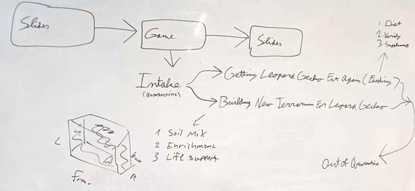
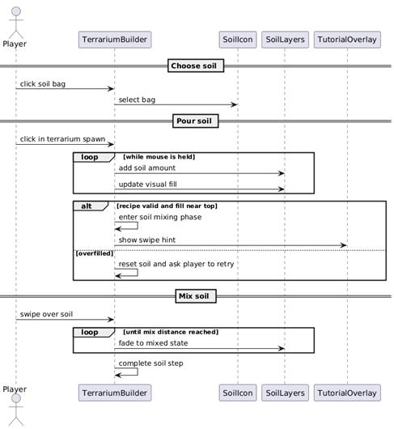

# Devlog: Soil mixing mini-game

*Created by Megan Spielberg, last modified on May 22, 2026*

## 💡 Introduction

After a meeting with Mariah Healey, an expert in reptile caretaking and
curator of a [large online database on reptile care](https://reptifiles.com), the decision
was made to remove the petting module and replace it with a terrarium
building system. She identified terrarium setup and feeding as two of
the most common areas where beginner keepers make mistakes.

The soil mixing minigame was designed to teach players the correct
substrate mixture for a leopard gecko habitat. The underlying
information is based on the Reptifiles care sheet, used with permission.

## 💭 Concept and Brainstorming

Initially, the game consisted of two modules: petting and feeding. These
were narratively connected by placing the player in the role of an
intern caring for a leopard gecko that already had an established
terrarium.

During a brainstorming session, this concept was revised. The player
still takes on the role of the intern, but now cares for a newly arrived
gecko. The animal is temporarily placed in a quarantine terrarium, and
the player is tasked with both feeding it and building a new,
appropriate habitat.

To structure the learning experience, the content was divided into three
stages, each representing an in-game day:

1.  Preparing the soil

2.  Adding enrichment

3.  Installing life support systems (e.g., a heat lamp)

The soil mixing minigame represents the first step in this sequence and
introduces the player to the terrarium building process.

## 🎨 Design

The soil mixing minigame was designed as a hands-on interaction to
communicate the correct substrate mixture. Instead of presenting the
information passively, the system requires the player to actively
combine materials, aligning gameplay with the intended learning outcome.

The design goal was to create an interaction that is:

- understandable without extensive instructions

- precise enough to allow controlled input

- directly connected to the learning objective (correct soil ratios)

 

## 1️⃣ First Iteration

The initial interaction used a drag-and-drop system combined with a
swiping motion to simulate mixing.

This approach aimed at creating a simple tactile and intuitive
experience by mimicking physical actions.

## 🎲 Playtest Version

The interaction was changed to a click-and-hold system, where materials
automatically pour when dragged over the terrarium. This iteration aimed
to introduce a higher level of challenge to the minigame in order to
increase player engagement.

## 🔍 Playtest Observations

Several observations were recorded regarding the soil system in the
terrarium builder.

- An inconsistency in terminology was noted, with the clipboard
  referring to “topsoil” while the corresponding in-game asset is
  labeled “dirt.”

- Difficulties with interaction controls were reported. Soil pouring was
  described as fast, making it hard to control the amount being added.
  The controls in the mixing minigame were noted as sensitive, and
  dragging soil bags was initially not intuitive for some players. A
  suggested alternative interaction method was a click-to-select and
  click-to-pour approach.

- Uncertainty about the soil mixing process was also documented. This
  includes unclear understanding of correct soil ratios and how the
  mixing system functions. The continuous animation during mixing
  contributed to this confusion.

- Feedback during the process was described as limited. It was not
  always clear whether the soil composition was correct or what the
  intended target mixture should be, and there were no consistent
  indications of success or failure.

- Some testers described the soil mixing minigame as enjoyable and
  engaging.

## 🏁 Final Iteration

Based on these observations, the interaction was revised. The final
version introduced a click-to-select system combined with a controlled
pouring action. This change separates selection and execution, making
the interaction more deliberate. It addresses the previously observed
issues with control and clarity while maintaining the interactive nature
of the minigame.

 

## ⚙️ Implementation Details

The soil mixing system is implemented as a sequence of interaction
states managed by the terrarium builder logic. The process is divided
into three main phases: soil selection, pouring, and mixing.

In the **selection phase**, the player clicks on a soil bag. This
triggers a selection event in the TerrariumBuilder, which stores the
currently active soil type and updates the corresponding UI element.

In the **pouring phase**, the player clicks inside the terrarium to
begin pouring soil. While the mouse button is held, the system
continuously adds soil to the terrarium. This is handled through an
update loop that runs each frame, incrementing the soil amount based on
time and input duration. Per-frame update is used because pouring is a
continuous, hold-based action, not a one-shot click. The amount added is
time-scaled, so it stays consistent across frame rates using delta. At
the same time, the visual representation of the soil layers is updated
to reflect the new fill level.

During this phase, the system checks for two conditions:

- If the soil composition and fill level meet the expected criteria, the
  system transitions to the mixing phase.

- If the container is overfilled, the system resets the soil state and
  prompts the player to retry.

In the **mixing phase**, the interaction switches from pouring to a
swipe-based input. The player moves the cursor across the soil surface,
and the system tracks the accumulated swipe distance. While this input
continues, the soil visually transitions toward a mixed state. Once a
predefined threshold is reached, the mixing is considered complete.

After completion, the system finalizes the soil layer and signals the
end of the soil preparation step, allowing the player to go back to the
terrarium view.

The whole process is visualized in Figure 5.

 

## Attachments

- [image-20260522-101900.png](images/65712/1114130.png)
- [image-20260522-102045.png](images/65712/65731.png)
- [image-20260522-102050.png](images/65712/852002.png)

