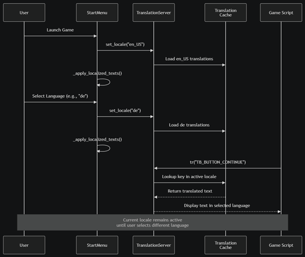

# Devlog: Localization

*Created by Megan Spielberg, last modified on May 22, 2026*

> ℹ️ **Note:** The current research prototype represents only a small part of the
> larger game *Scaly Sanctuary*. It focuses on a micro gameplay loop, but
> even at this early stage, it is important to think ahead. One key system
> that benefits from early integration is **localization**.
> Adding localization later in development can become messy and
> time-consuming, especially when UI text is already deeply embedded in
> scripts and scenes. By implementing it now, the project is structured
> from the beginning to support multiple languages. This reduces future
> refactoring and ensures that all newly added features automatically
> follow a localization-friendly workflow.

## 📚 References

To guide the implementation, several tutorials were used as references:

- *Godot Localization Tutorial \[4.4\]* –
  [Weekie’s Game Dev Tutorials](https://www.youtube.com/watch?v=vD5mha26JXo) ,
  [GitHub](https://github.com/WeekieNHN/localization_package)

- *Localization/Translation in Godot is so easy!* –
  [jitspoe](https://www.youtube.com/watch?v=Lw-3Tnwv4Ds)

- *UI Translations in Godot 4.5* – [Mostly Mad Productions](https://www.youtube.com/watch?v=S3frAAfnyKc&t=42s&pp=ygUSZ29kb3QgbG9jYWxpemF0aW9u0gcJCcMKAYcqIYzv)

## 🛠️ Implementation

The *Scaly Sanctuary* project uses Godot’s built-in translation
framework to implement a **multi-language localization system**. The
system is designed to be scalable, maintainable, and efficient at
runtime.

### 📃 Translation Source

At the core of the system is a single file: **Translations.csv**

This file acts as the *single source of truth* for all translatable text
in the game.

**Structure:**

```gdscript
KEY | en_US | de | nl | ro_RO
```

Each row represents:

- A unique **key** (identifier for a piece of text)

- Translations for each supported language

**Reasoning:**\
Using a centralized CSV file ensures consistency across the project.
Instead of searching through scripts and scenes, all text can be managed
in one place. This also makes it easier to collaborate with translators
or update text later without touching code.

### 📥 Translation Import Pipeline

Godot does not use the CSV file directly at runtime. Instead, it
converts it into optimized binary files:

- The configuration file Translations.csv.import tells Godot how to
  process the CSV

- The importer generates .translation files:

  - Translations.en_US.translation

  - [Translations.de](http://translations.de/).translation

  - [Translations.nl](http://translations.nl/).translation

  - [Translations.ro](http://translations.ro/)\_RO.translation

**Reasoning:**\
Binary translation files improve performance because:

- They load faster than raw text files

- They reduce parsing overhead during runtime

- They are more compact in size

This is especially important as the project grows and the number of
strings increases.

### 📋 Project Registration

All generated translation files are registered in the project.godot file
under the \[internationalization\] section.

Godot’s **TranslationServer** automatically loads these files when the
game starts.

**Reasoning:**\
Automating this step ensures that:

- No manual loading is required in scripts

- All translations are always available globally

- The system remains clean and less error-prone

### 🌎 Supported Languages

The project currently supports four languages:

- English (en_US) – default language

- German (de)

- Dutch (nl)

- Romanian (ro_RO)

**Reasoning:**\
English is used as the default because it is widely understood and
serves as the base language for development. Adding multiple languages
early allows testing of edge cases, such as:

- Text length differences

- Special characters

- UI layout constraints

### 🔃 Runtime Translation Flow

#### ⚙️ Start Menu (start\_[<strong>menu.gd</strong>](http://menu.gd/)**)**

The start menu is responsible for initializing and controlling language
selection:

- Sets the default locale to **English (en_US)** on launch

- Displays a dropdown menu with all available languages

- Uses user-friendly names (e.g., *Deutsch* instead of *de*)

- When a language is selected:

```gdscript
TranslationServer.set_locale(locale)
```

- Calls *apply*localized_texts() to refresh all UI elements

**Reasoning:**\
Separating language selection into the start menu creates a clear entry
point for localization. Immediate UI updates ensure that users receive
instant feedback, improving usability.

#### 📝 In-Game Scripts (e.g., terrarium\_[<strong>builder.gd</strong>](http://builder.gd/)**)**

Translations are applied dynamically in scripts using:

```gdscript
continue_button.text = tr("TB_BUTTON_CONTINUE")
```

or:

```gdscript
var species_name := TranslationServer.translate(care_data.species_name)
```

**Reasoning:**

- tr() is concise and ideal for UI elements

- TranslationServer.translate() allows more flexibility when working
  with dynamic data

Both methods ensure that text is always resolved based on the currently
active language.


** **

### 💡 Key Design Patterns

#### 🔑 Declarative Translation Keys

All text is referenced using semantic keys, such as:

- TB_BUTTON_CONTINUE

- CRAFTING_SIGN_CRICKET

**Reasoning:**\
This avoids hardcoding text and makes it easier to:

- Rename or update text globally

- Keep code language-independent

- Maintain clarity about where text is used

#### 📁 Centralized Management

All translations are stored in one CSV file.

**Reasoning**:\
This prevents:

- Duplicate or inconsistent translations

- Missing entries across languages

It also simplifies exporting the file for external translators.

#### ⌛ Lazy Translation

Text is translated only when needed:

- During UI setup

- When the language changes

**Reasoning:**\
This approach improves performance by avoiding unnecessary processing
and ensures that updates happen only when required.

#### ⬇️ Fallback Mechanism

The system handles locale variations, for example:

- "en-US" → "en"

**Reasoning:**\
Different systems may return slightly different locale formats. This
fallback ensures compatibility and prevents missing translations due to
formatting mismatches.



### ✅ Conclusion

Implementing localization early in *Scaly Sanctuary* establishes a
strong foundation for future development. The system is:

- **Scalable** – easy to add new languages

- **Maintainable** – centralized and structured

- **Efficient** – optimized for runtime performance

Most importantly, it ensures that all future features are built with
internationalization in mind, avoiding costly refactoring later in
development.
