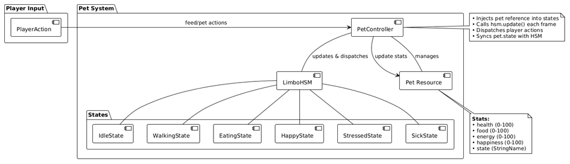
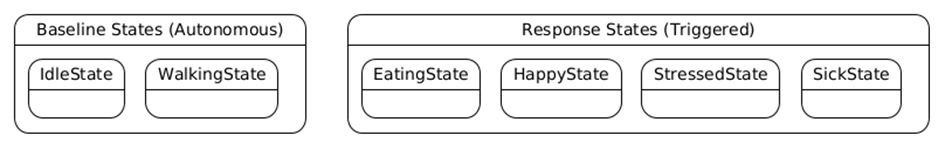
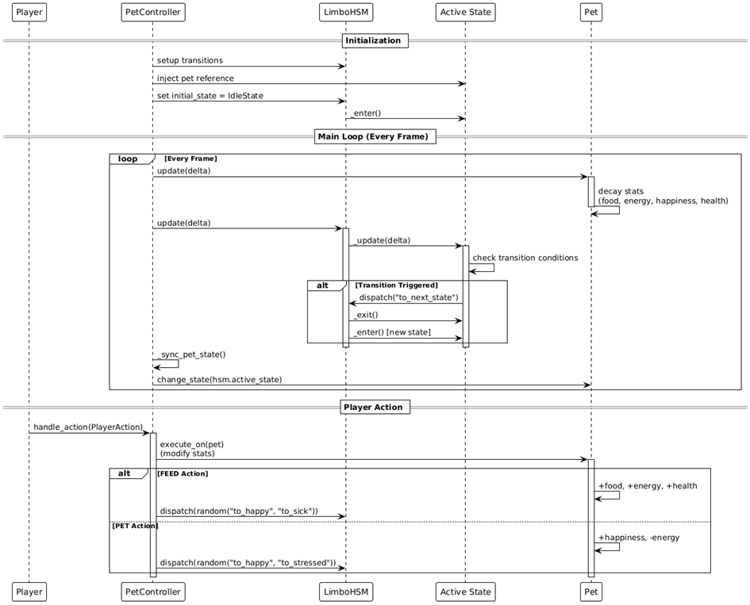

# Devlog: Animal State Machine

*Created by Megan Spielberg, last modified on May 25, 2026*

> ⚠️ **Warning:** This state machine was changed and simplified for the research
> prototype, as the focus was no longer on realistic/interpretable animal
> behavior.

> ℹ️ **Note:** This document explains how the reptile/pet behavior system is
> implemented using a hierarchical state machine (HSM) powered by the
> LimboAI plugin. The system provides autonomous pet behavior with
> transitions between emotional and behavioral states, responding to both
> time-based triggers and player interactions.

### 📋 Requirements/Challenges

- As a player, I want my positive interactions to noticeably improve my
  reptile's mood so that I feel a sense of progress and bonding. (S)

- As a player, I want to see clear evidence that the reptile has
  interacted with its food so that I know the feeding was successful.
  (M)

Only the minimum number of states is implemented to support the player
actions of FEEDING and PETTING.

### 🏗️ Architecture

The pet behavior system consists of three primary components:

| Component | Description |
|----|----|
| Pet Resource | Data model containing pet stats (health, food, energy, happiness) |
| PetController | Orchestrates state machine updates and player action handling |
| LimboHSM with LimboState nodes | Individual state implementations with self-contained transition logic |



### 🗂️ State Categories

The states are organized into two conceptual categories:

#### 📏 Baseline States (Autonomous Behavior)

Idle ↔ Walking: These states cycle automatically based on energy-driven
probabilities (checked every 3 seconds)

IdleState → WalkingState: Higher energy increases walking chance (5-40%
per check)

| Energy Level | Walking Chance |
|-----------------------|--------------------|
| High energy (80-100)  | ~30-40% chance     |
| Medium energy (40-80) | ~15-30% chance     |
| Low energy (0-40)     | ~5-15% chance      |

WalkingState → IdleState: Lower energy increases resting chance (5-50%
per check)

| Energy Level | Resting Chance |
|-----------------------|--------------------|
| Low energy (0-20)     | ~40-50% chance     |
| Medium energy (20-60) | ~20-40% chance     |
| High energy (60-100)  | ~5-20% chance      |

#### ⚡ Response States (Player-Triggered Reactions)

- EatingState: Pet is actively eating in response to FEED action

- HappyState: Positive emotional response to good food or being petted
  correctly.

- StressedState: Negative emotional response to being petted in the
  wrong area

- SickState: Illness state in response to feeding the wrong food
  (persists until health recovers)

These states represent the pet's reactions to player actions (FEED or
PET). After completing their duration or meeting exit conditions, they
return to the appropriate baseline state based on the pet's current
needs.



### 🔄 State Transition Rules

There is no concrete rule yet when to start or stop walking. It is done
via timers right now. The feeding and petting result in a random
happy/sick or happy/stressed state right now. This will be changed once
these functions are implemented.



### ⚙️ State Implementation Details

Each state inherits from `LimboState` and implements three key methods:

```gdscript
class_name <StateName>
extends LimboState
var pet: Pet # Injected by PetController
4
func _enter() -> void:
## Called when entering this state
## Initialize timers, determine behavior
func _exit() -> void:
## Called when leaving this state
## Cleanup
func _update(delta: float):
## Called every frame while active
## Check conditions, trigger transitions
```

### 📈 Pet Stats System

The `Pet` resource maintains four core stats that decay over time:

```gdscript
@export var health: int = 100 # Overall wellbeing (0-100)
@export var food: int = 100 # Hunger satisfaction (0-100)
@export var energy: int = 85 # Stamina/tiredness (0-100)
@export var happiness: int = 70 # Emotional state (0-100)
```

All stats are stored as integers (0-100 range) but decay needs to happen
smoothly over time.

### ⌛ The Fixed Timestep Solution

Instead of updating stats every frame (which would be 60+ times per
second), we use a fixed timestep approach that updates stats at regular
intervals:

```gdscript
const STAT_UPDATE_INTERVAL: float = 1.0 # Update once per second
var stat_update_timer: float = 0.0
```

#### 💡 How it works (and why it's frame-rate independent)

- Each frame, accumulate actual elapsed time (`delta`) in the timer

- When timer reaches the interval (1.0 second of real time), run stat
  decay logic

- Reset timer and continue

The key insight: `delta` represents real elapsed time, not frames

| FPS | Delta (approx.) | Frames to reach 1.0s |
|---------|---------------------|--------------------------|
| 60 FPS  | ≈ 0.0167s           | ~60 frames               |
| 30 FPS  | ≈ 0.0333s           | ~30 frames               |
| 144 FPS | ≈ 0.0069s           | ~144 frames              |

In all cases, exactly 1.0 second of real time passes before stat decay
occurs, making it perfectly frame-rate independent.

#### ⚡ Performance Benefits

- 60x fewer calculations at 60 FPS (1 update/sec vs 60 updates/sec)

```gdscript
ort var happiness: int = 70 # Emotional state (0-100)
```

All stats are stored as integers (0-100 range) but decay needs to happen
smoothly over\
time.\
5\
The Fixed Timestep Solution\
Instead of updating stats every frame (which would be 60+ times per
second), we use a\
fixed timestep approach that updates stats at regular intervals:

```gdscript
const STAT_UPDATE_INTERVAL: float = 1.0 # Update once per second
var stat_update_timer: float = 0.0
```

How it works (and why it's frame-rate independent):

1.  Each frame, accumulate actual elapsed time (`delta`) in the timer

2.  When timer reaches the interval (1.0 second of real time), run stat
    decay logic

3.  Reset timer and continue\
    The key insight: `delta` represents real elapsed time, not frames

- At 60 FPS: `delta` ≈ 0.0167s → takes ~60 frames to reach 1.0s

- At 30 FPS: `delta` ≈ 0.0333s → takes ~30 frames to reach 1.0s

- At 144 FPS: `delta` ≈ 0.0069s → takes ~144 frames to reach 1.0s\
  In all cases, exactly 1.0 second of real time passes before stat decay
  occurs, making\
  it perfectly frame-rate independent.\
  Performance Benefits:

- 60x fewer calculations at 60 FPS (1 update/sec vs 60 updates/sec)

- Simpler logic, no accumulators needed

- More predictable - consistent tick rate regardless of framerate

- Frame-rate independent - uses `delta` to measure real elapsed time,
  not frame count

- Easier to reason about - "food drops X per second" is intuitive

### Attachments

- [image-20260522-105115.png](images/884764/1376277.png)
- [image-20260522-105135.png](images/884764/1638660.png)
- [image-20260522-105149.png](images/884764/262368.png)

