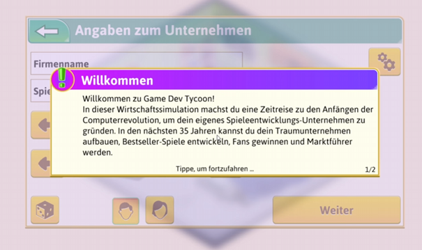
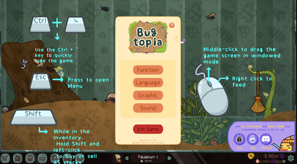
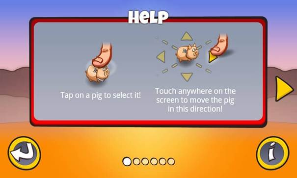
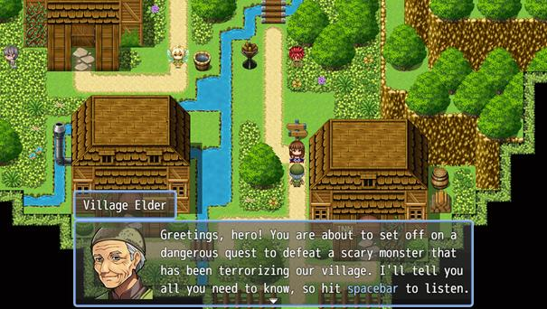
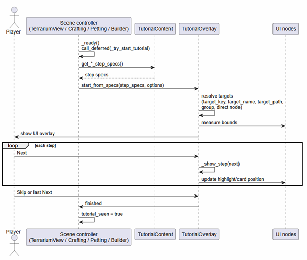

# Devlog: Tutorial system

*Created by Megan Spielberg, last modified on May 22, 2026*

## ⚠️ Problem: Player Familiarity and Data Collection

Not every player approaches a game with the same level of familiarity or
confidence. Even players who regularly engage with games still need to
adapt to new control schemes, interaction patterns, and interface
layouts, which can vary significantly between projects. This is
especially relevant in the context of a research prototype, where the
primary goal is not entertainment alone but also the collection of
meaningful user interaction data. If players struggle to understand how
to interact with the system, their experience becomes frustrating, and
the validity of the research outcomes is compromised.

Because of this, it is necessary to guide players through the core
interactions of the game in a way that reduces confusion while still
allowing them to explore. The tutorial acts as a bridge between the
player and the system, introducing essential mechanics and UI elements
in a structured way.

## 🔍 Research

To inform the design of the tutorial, existing 2D games were analyzed
with a focus on how they introduce mechanics and controls to new
players. This included both direct observation of tutorials in games and
reviewing general best practices from external resources. A key takeaway
from this research is that effective tutorials are often integrated into
gameplay and avoid overwhelming the player with too much information at
once.

The referenced materials emphasized concepts such as gradual onboarding,
contextual instruction, and the importance of maintaining player agency.
They also highlighted common pitfalls, such as overly intrusive tutorial
pop-ups or rigid step-by-step instructions that interrupt the natural
flow of the game. Despite these insights, practical constraints
influenced the final implementation, leading to a more traditional
overlay-based approach.

### 📚 Referenced Materials

- **Videogame Tutorial Design** By Chinmaya Naithani
  [https://www.instructables.com/Videogame-Tutorial-Design/](https://www.instructables.com/Videogame-Tutorial-Design/)

- **Tutorials 101 - How to Design a Good Game Tutorial - Extra Credits**

[https://www.youtube.com/watch?v=BCPcn-Q5nKE](https://www.youtube.com/watch?v=BCPcn-Q5nKE)

### 📷 Tutorial Examples



## 💡 Solution: Modular Overlay Architecture

The tutorial system was implemented as a modular and reusable overlay
architecture, which separates core functionality, content definition,
and scene-specific integration. Figure 5 shows the structure of the UI
overlay. It consists of a transparent background node. A square to
highlight the element on screen. And then a card containing the elements
description, a skip, and a next button.


*Figure 5: Tutorial overlay node editor in Godot*

The tutorial system is built as a modular and reusable overlay
architecture. It separates core functionality, content definition, and
scene-specific logic. This separation is also shown in the system
diagram. The overlay controller, the content provider, and the gameplay
scenes are independent components that communicate with each other.

### ⚙️ Overlay Controller (tutorial_overlay.gd)

At the core of the system is the overlay controller, implemented in
tutorial_overlay.gd. This component handles the visual side of the
tutorial. It creates a dimmed background to guide the player’s
attention, highlights specific UI elements, and shows an information
card for each step. It also manages user input, such as moving to the
next step or skipping the tutorial. At runtime, the script does not
create the UI elements themselves. Instead, it only generates the visual
masking. It creates several ColorRect segments that form the darkened
background, leaving a cutout around the highlighted element.

The actual UI elements come from the active scene. The overlay uses step
definitions from tutorial_content.gd to find these elements. It resolves
them dynamically using identifiers such as target_name, target_key,
target_path, or group membership. This means the scene provides the
nodes, and the overlay adapts them into a consistent tutorial flow.
Because of this, the same overlay system can be reused across different
scenes.

### 📃 Tutorial Content (tutorial_content.gd)

The tutorial content is defined separately in tutorial_content.gd. This
script contains structured step data for each scene, including text
descriptions and references to target elements. Keeping this separate
makes the system easier to extend and maintain.

### 🎮 Gameplay Scenes

Each gameplay scene, such as the terrarium view or crafting menu, is
responsible for starting the tutorial. As shown in Figure 6, the scene
acts as the entry point. When the scene loads, it delays the tutorial
start until all UI elements are ready. It then requests the correct step
data and passes it, together with a mapping of its UI nodes, to the
overlay.

A key part of this system is the use of node groups. UI elements can be
assigned to groups if they should appear in the tutorial. This allows
the overlay to find them without hardcoding references. It makes the
system more flexible and scalable.

### ▶️ Runtime Flow

The runtime flow follows a clear sequence. The scene starts the tutorial
and sends the step data to the overlay. The overlay processes each step,
resolves the target element, and creates the dimmed background with a
cutout. It then positions the explanation text near the element. The
player can move through the steps using the controls. When the tutorial
ends or is skipped, the overlay sends a signal back to the scene. The
scene then marks the tutorial as completed, so it does not play again.



## 📝 Example: Scene Connection

The provided code snippet demonstrates how a scene connects to the
tutorial system in practice. The scene ensures that the tutorial is not
already active or previously completed, preventing unnecessary
repetition. It then constructs a mapping between logical identifiers and
UI nodes, which allows the overlay to correctly highlight elements
during each step.

After preparing this mapping, the scene calls the overlay’s start
function and passes in the step specifications retrieved from the
content module. If the tutorial starts successfully, the scene updates
its internal state to reflect that the tutorial is currently active.
This pattern is reused across different scenes, ensuring consistency in
how tutorials are triggered and executed throughout the game.

```gdscript
 func _start_tutorial(force: bool) -> void:
    if tutorial_overlay == null:
        return

    if not force and (_tutorial_seen or _tutorial_active):
        return

    if force and _tutorial_active:
        tutorial_overlay.finish()

    var node_map := {
        "feed_button": feed_button,
        "pet_button": pet_button,
        "clipboard_button": clipboard_button,
        "loop_counter_label": loop_counter_label,
        "loop_checklist_label": loop_checklist_label
    }

    if tutorial_overlay.start_from_specs(
        TutorialContent.get_terrarium_view_step_specs(),
        {"target_key_map": node_map}
    ):
        _tutorial_active = true
```

## 💬 Reflection on Feedback

The feedback highlighted several weaknesses in the current
implementation, particularly regarding its usability and design quality.
The overlay-based tutorial was criticized for being intrusive and not
well integrated into the gameplay experience. Suggestions included
disabling the skip option during testing, exploring alternative tutorial
formats outside the main game flow, and shifting towards a more
narrative-driven approach that introduces mechanics through character
interaction or guided scenarios.

Despite these criticisms, playtesting results indicate that the tutorial
still fulfilled its basic purpose. Most players engaged with the
instructions and were able to navigate the interface without major
issues. This suggests that, while not optimal, the system is functional
and provides a necessary level of guidance.

> ℹ️ **Note:** Reflecting on both the research and the feedback, it is clear that the
> current solution prioritizes practicality over design quality. Time
> constraints and competing development priorities led to the decision to
> implement a simpler, more conventional tutorial system. While this
> approach is not ideal, it establishes a foundation that can be iterated
> upon in the future.
> The long-term goal is to move towards a more seamless and immersive
> tutorial experience. This would involve integrating instructions
> directly into gameplay, using narrative elements to guide the player,
> and creating a more cohesive flow that aligns with the overall design of
> the game.
