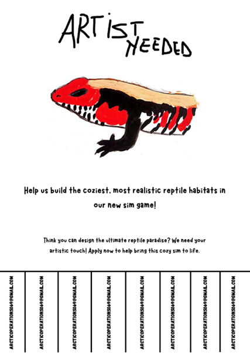
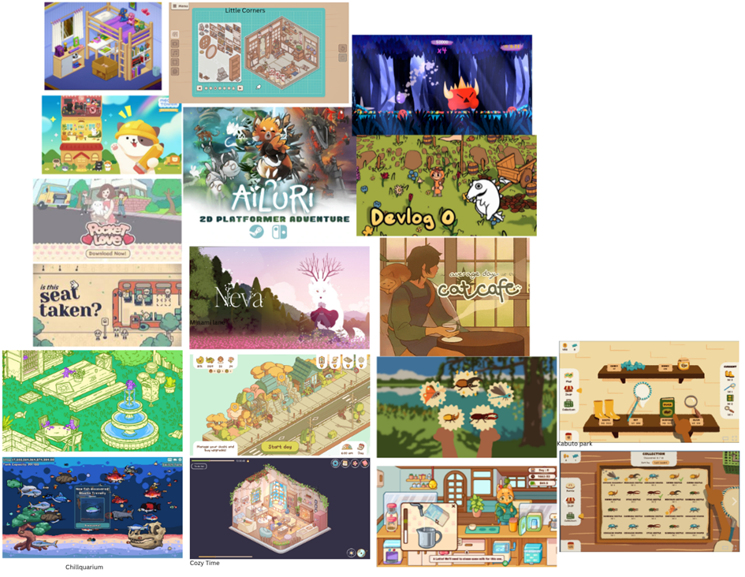
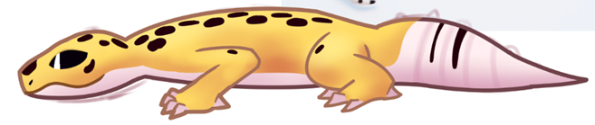
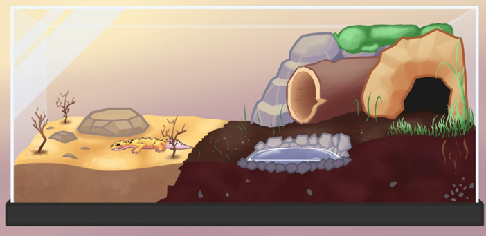
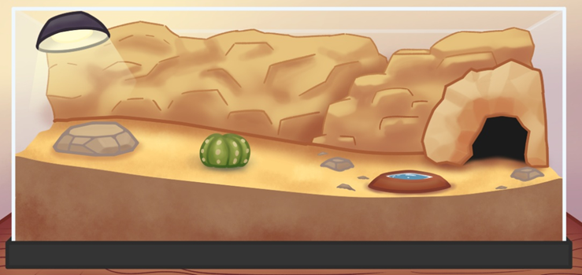
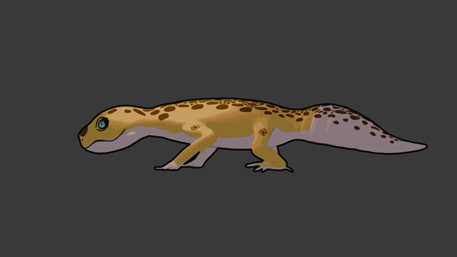
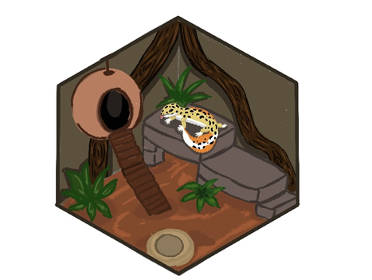
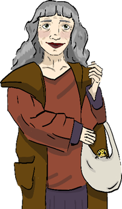

# Artist collaboration

*Created by Megan Spielberg, last modified on May 25, 2026*

## 🌱 Initial Situation

After working together on two game jams, Andy and I decided to start a
larger project. We agreed on the idea of a *reptile sanctuary*. Early
on, we realized we needed an artist, since neither of us had the skills
to create the visual style we had in mind.

Because of this, we decided to look for someone who could join the team
and help define the art style of the game.

## 👥 Recruitment

We put up posters at Fontys ICT and Fontys Venlo to find an artist. We
received a response within one day. After reviewing the candidate’s
social media to check if the art style matched what we were looking for,
we invited him for an interview.

The interview went well, and **Jip Martens**, an Industrial Product
Design student at Fontys Venlo, joined our team as the main artist.

## 🎨 Art Style Development

Together with Jip, we looked at art styles from similar games to figure
out what direction we wanted to take. We also discussed what would be
realistic to create within our time and skill limits.

In the end, we chose a **colorful 2D style** with:

- Soft shading

- Soft outlines

- A stylized look

- Medium to low level of detail

Following this meeting, Jip created the first concept art, including the
leopard gecko and the terrarium.

### 🧭 Art Direction and Asset Planning

My role was to help guide the accuracy of the reptile and terrarium
design. For example, I made sure details like toe direction and
substrate setup were realistic. I also provided Jip with a list of
required assets and their priorities. Based on this, he worked on
refining and creating more final visuals.

### 📦3 D Model

From the start, it was clear that Jip did not have experience with
animation. We first used static sprites as placeholders, but during the
first playtest, it became clear that players expected a more dynamic
reptile. To solve this, we contacted students from SintLucas. **Lucas
Gubbels**, a 3D artist, agreed to create a **leopard gecko model** with
animations and a toon shader. We provided him with references and a list
of required animations to match our style.

### 🙍 Characters

While Jip focused on in-game assets, we also needed characters for the
story. We asked another SintLucas student, **Flore van Buul**, to create
some concept art to see if her style would fit the game.

The style did not fully match, but we still needed characters and
introduction slides for the research prototype. We decided to commission
her to create the characters anyway.

In the end, the characters stood out slightly from the rest of the
visuals, but not as much as expected. More importantly, they matched the
personalities and tone of the story, so we decided to include them in
the prototype.

## Attachments

- [image-20260522-105535.png](images/622688/1540109.png)
- [image-20260522-105615.png](images/622688/1572871.png)
- [image-20260522-105621.png](images/622688/458803.png)
- [ff63602a-9732-4bd9-9d6d-07c1903a515c.png](images/622688/1081359.png)
- [image-20260522-105657.png](images/622688/1179664.png)
- [image-20260522-105724.png](images/622688/1474569.png)
- [image-20260522-105733.png](images/622688/753682.png)
- [image-20260522-105743.png](images/622688/1409048.png)
- [image-20260522-105752.png](images/622688/1441804.png)
- [image-20260522-105808.png](images/622688/1409054.png)
- [image-20260522-105819.png](images/622688/1376284.png)
- [image-20260522-105827.png](images/622688/1638666.png)
- [5bc791b2-1d28-4dd4-bfa3-db80c8fc7982.png](images/622688/1507343.png)

