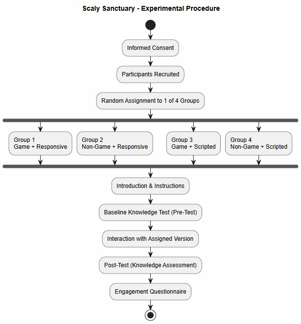
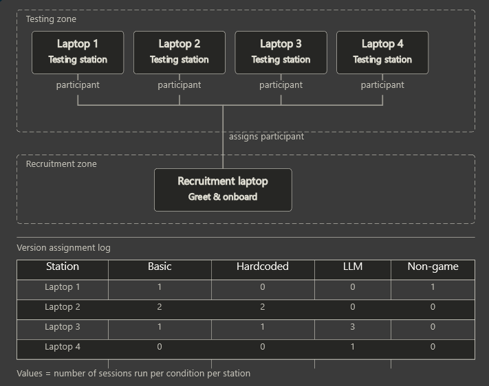
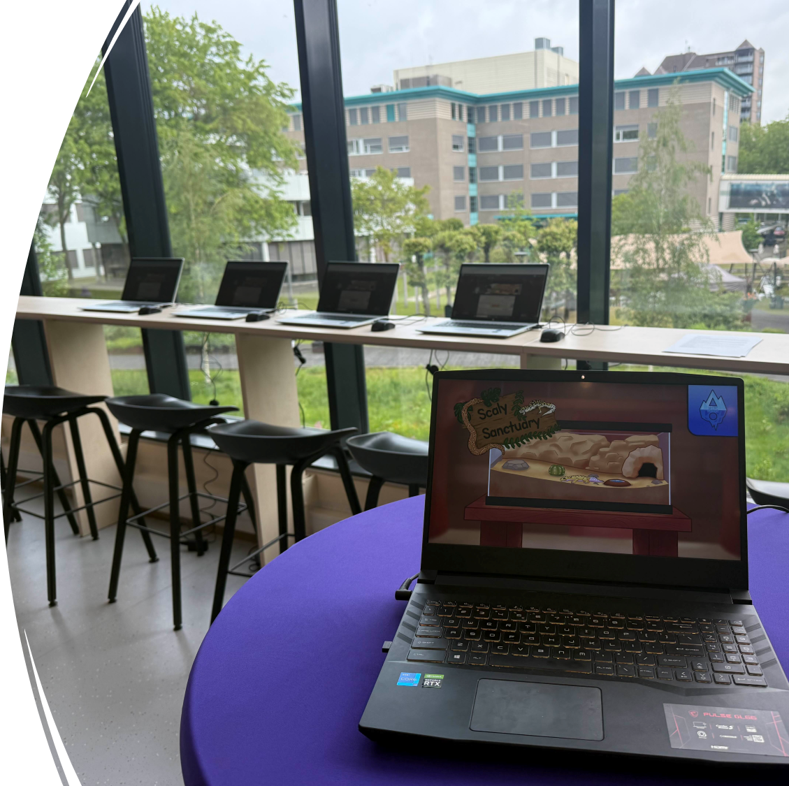
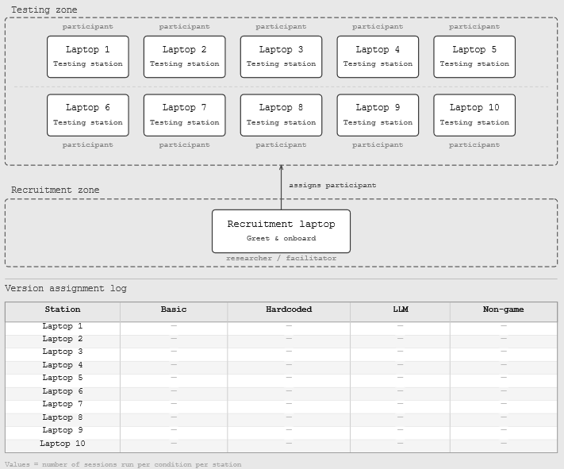

# Data Collection Setup

*Created by Megan Spielberg, last modified on May 29, 2026*

> ℹ️ **Note:** Author: Megan and Valentino

This document describes the experimental setup and data collection
process used during the testing sessions at the Fontys IT Festival and
Night of the Nerds. The purpose of the setup was to evaluate participant
interaction under different experimental conditions while ensuring
consistency across all testing stations.

## 📋 Testing Procedure

The testing procedure followed a structured workflow to ensure that all
participants completed the experiment under the same controlled
conditions. Each participant was guided through the experiment
individually, allowing researchers to observe user behavior and maintain
consistent testing quality.

Participants were first welcomed and given a short introduction to the
study. After agreeing to participate, they were assigned to one of the
testing conditions. The experiment included multiple stages, including
introduction, a knowledge questiionnair, interaction with the assigned
system, task execution, and completion of a questionnaire for
qualitative feedback.

## 🖥️ Physical Testing Setup

The physical testing setup was designed to support multiple simultaneous
participants while minimizing distractions and interference between
conditions. Several laptops were prepared in advance, each configured
with a specific experimental condition or system version.

The setup included clearly labeled testing stations, allowing
researchers to quickly assign participants to the correct condition.
Recruitment laptops were placed separately from the testing devices to
avoid confusion and maintain a smooth participant flow.

The environment was intentionally organized to create a controlled yet
accessible testing experience during public events such as the Fontys IT
Festival and Night of the Nerds.

Figure 3. Physical testing environment and laptop setup during the
event.

## ⚙️ Experimental Conditions

Participants were distributed across several experimental conditions.
The table-based allocation system helped researchers monitor participant
counts for each condition in real time. By tracking assignments, the
experiment maintained a balanced dataset and reduced the risk of
overrepresentation within specific groups.

Figure 4. Testing setup for Night of the Nerds

## 👥 Participant Distribution Strategy

To reduce social influence and cross-condition contamination,
participants were spaced apart whenever possible. When participants were
seated close to one another, they were assigned to the same condition.
This minimized the likelihood of participants observing different
conditions or influencing each other’s responses.

This approach we hoped would improve experimental consistency and
reduced potential bias caused by participants comparing systems during
the testing session.

## 📊 Data Collection & Observations

During each session, researchers observed participant interactions and
recorded relevant behavioral data. In addition to system-generated
metrics, qualitative feedback was collected through questionnaires and
direct observations.

The collected data can be used for later analysis of knowledge retention
and engagement. Combining quantitative and qualitative observations
provided a more complete understanding of participant experiences during
the experiment.

## Attachments

- [image-20260522-115258.png](images/393217/720942.png)
- [image-20260522-115339.png](images/393217/491558.png)
- [image-20260522-115411.png](images/393217/197349.png)
- [image-20260522-115411.png](images/393217/1703948.png)
- [image-20260529-091757.png](images/393217/7241729.png)
- [image-20260529-091826.png](images/393217/7274497.png)
- [study_procedure-20260529-091948.png](images/393217/7077890.png)

