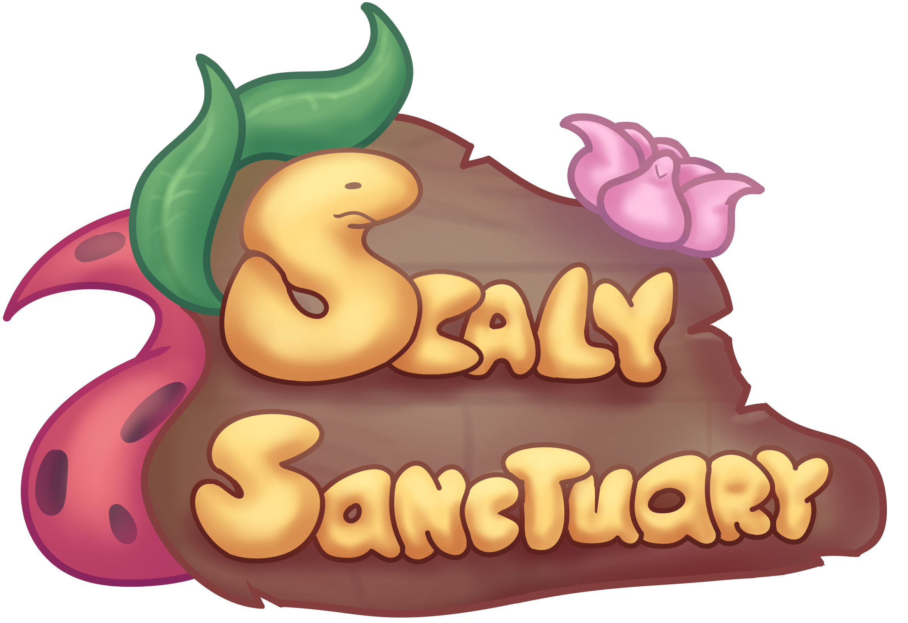

# Master of Applied IT Graduation Project Documentation and Devlogs

*Created by Megan Spielberg, last modified on May 22, 2026*

This space contains detailed documentation of a Master of Applied IT
graduation project. It contains the research artifacts and the research
prototype implementation details in the form of Devlogs.

## Attachments

- [logo.png](images/295008/753695.png)
- [logo-20260508-081515.png](images/295008/1343506.png)
- [leopard_gecko.png](images/295008/655375.png)
- [leopard_gecko.png](images/295008/458811.png)

