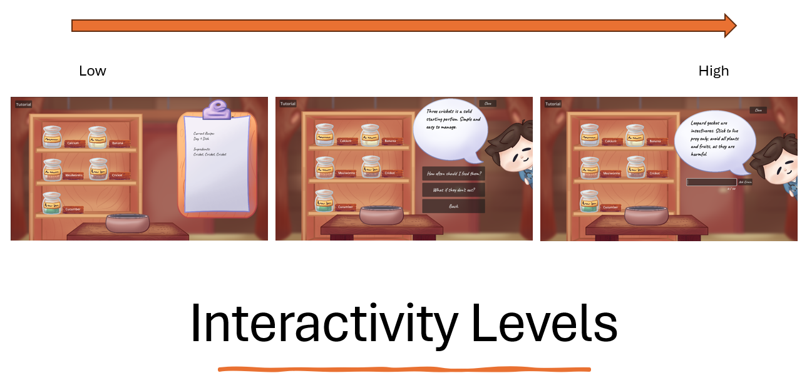
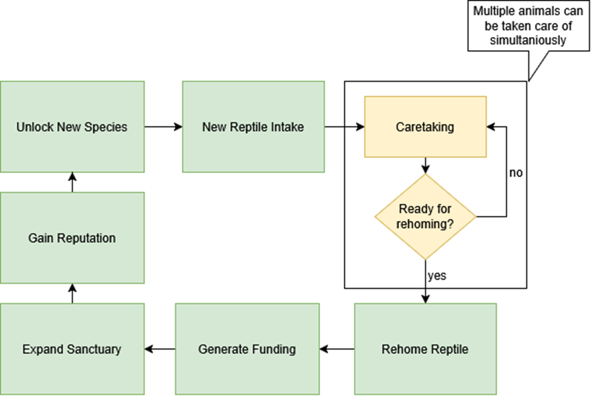

# Research Prototype

*Created by Megan Spielberg, last modified on May 26, 2026*

## 🐍 Scaly Sanctuary Prototype

The *Scaly Sanctuary* prototype served as the primary experimental
platform, designed as a casual reptile caretaking experience with
accessible mechanics, simple interactions, and short play sessions
(Gajadhar et al., 2010; Johnson, 2018; Juul, 2012; Kuittinen et al.,
2007). The leopard gecko caretaking game was developed specifically for
this study, and all conditions were based on the same factual knowledge
base derived from the *ReptiFiles Leopard Gecko Care Sheet* authored by
Mariah Healey. Written consent was obtained to use this material both as
the informational foundation for all game conditions and as the care
sheet presented directly in the non-game control condition.

### 🎮 Game Modules

The game consists of two identical interactive modules across
conditions: Feeding and Terrarium Building. In the Feeding module,
players prepare a meal by dragging ingredients into a food bowl using a
crafting mechanic, while in the Terrarium Building module, players
assemble the enclosure by selecting and placing components. The tasks
themselves remain structurally identical across all game conditions;
what differs is how educational content is accessed to support
decision-making.

### 💡 Educational Content Delivery

Educational content consistently covered feeding and terrarium setup,
but was delivered differently depending on the condition. In the
low-interactivity game condition, information was embedded as
clipboard-style instructional text presented alongside gameplay tasks,
with players completing activities while reading static written
instructions and having limited interaction with the educational
material. In the interactive RPG-style vet chat condition, the same
information was instead provided through an in-game chat interface, with
NPC guidance through pre-chosen questions that could be asked. In the
LLM-interactive condition, a veterinary NPC—constrained by a
domain-specific system prompt aligned with the ReptiFiles care
sheet—enabled players to ask open-ended questions in natural language,
receive conversational responses, and explore topics beyond scripted
dialogue through follow-up questions based on in-game observations.

### ⚙️ Game Conditions vs. Control

Both game conditions included goals, progression systems, and task
completion structures consistent with established definitions of games
in prior literature (National Research Council, 2011). The control
condition removed all gameplay structures entirely and presented the
same informational content as a static PDF care sheet.

## 🎮 Scaly Sanctuary as a Game

### 🔁 Micro Gameplay Loop

The game has a micro gameplay loop, represented by the yellow sections
of the gameplay loop (Figure 2). This loop centres on the caretaking of
reptiles within the sanctuary. Players engage in caretaking activities
where multiple reptiles can be managed simultaneously, with the primary
goal of preparing animals for successful rehoming. The cycle repeats
until each reptile is considered ready for adoption or transfer.

### 🌲 Broader Sanctuary Management Systems

The broader sanctuary management systems, represented by the green
sections of the gameplay flow, were outside the scope of the current
prototype and are intended for future development. These larger gameplay
systems include generating funding, expanding the sanctuary, gaining
reputation, and unlocking access to new reptile species. Together, these
mechanics form the long-term progression loop that would support and
contextualise the caretaking gameplay in a full implementation.

## 🎮 The General Game GDD

[Scaly Sanctuary GDD V2.pdf](images/720897/4685825.pdf)
