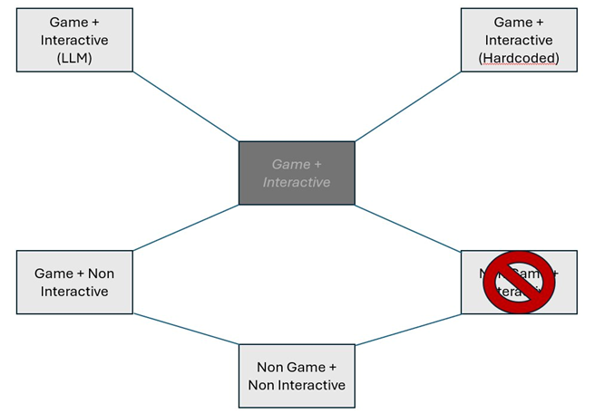
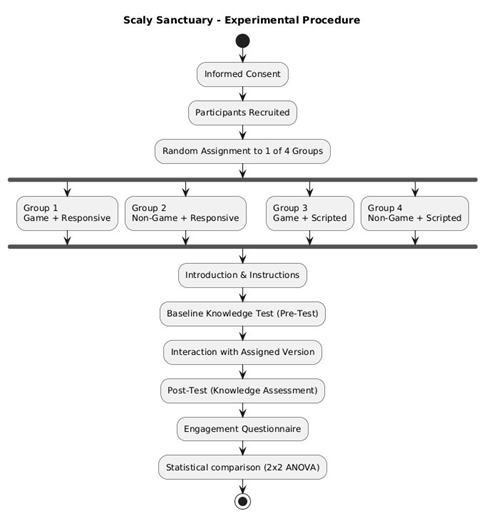

# Study Design

*Created by Megan Spielberg, last modified on May 24, 2026*

> ℹ️ **Note:** Author: Megan and Valentino

## 💡 Introduction & Research Objectives

This document presents a unified study design merging two parallel
research projects that investigate game-based learning (GBL) for reptile
caretaking education. The Scaly Sanctuary study applied a 2×2 factorial
design examining game structure and animal responsiveness.

The combined design retains four experimental conditions but
restructures them around the overarching question:

***How do game structure and interactivity level influence knowledge
acquisition and user engagement in a digital reptile caretaking
experience?***

One condition present in Spielberg's original 2×2 factorial — Non-Game +
Interactive (real-animal handling) — has been deliberately excluded from
this combined design. As shown in the conditions diagram below, this
cell was removed because it is not feasible to standardise a live-animal
interaction against a digital game condition, and because the
theoretical interest lies in comparing game versus non-game formats and
scripted versus LLM-driven interactivity within the game context. The
resulting design covers four conditions along an interactivity spectrum,
with the highest-interactivity condition implemented in two ways.

**Figure 1. Combined condition structure (Non-Game + Interactive
excluded)**

*The central hub shows that 'Game + Interactive' has two
implementations. The crossed-out cell (Non-Game + Interactive) is
excluded from this study.*

## ⚙️ Experimental Design

### 📊 Design Structure

The study uses a single-factor between-subjects design with four ordered
conditions representing an escalating spectrum of game structure and
interactivity. Core educational content is identical across all groups.
Within Condition 3 (Game + Interactive), two parallel implementations
are evaluated as sub-conditions to compare hardcoded dialogue trees
against LLM-driven conversational interaction.

**Table 1. Experimental Conditions**

| \# | Condition | Game? | Interactivity | Delivery Method |
|----|----|----|----|----|
| 1 | Non-Game + Non-Interactive | No | None | Caresheet only; no game elements |
| 2 | Game + Non-Interactive | Yes | Scripted / Passive | In-game caresheet; goals and progression, no action feedback |
| 3a | Game + Interactive (Hardcoded) | Yes | High — Scripted Dialogue | Vet NPC with RPG-style fixed dialogue trees |
| 3b | Game + Interactive (LLM) | Yes | High — LLM Dialogue | Vet NPC with LLM/chatbot logic, conversational style |

*Conditions 3a and 3b share the same treatment slot in the primary ANOVA
but are compared with each other in a secondary analysis.*

### 🔍 Independent Variables

- **Game Structure:** Non-Game (C1) vs. Game (C2–3). Game format adds
  goals, progression, feedback, and task completion.

- **Interactivity Level:** None (C1) → Passive (C2) → Hardcoded High
  (C3a) → LLM High (C3b).

### 📈 Dependent Variables

- **Knowledge Gain:** Post-test score minus pre-test score on a reptile
  care knowledge quiz.

- **Engagement:** Composite score from a post-experience questionnaire
  assessing enjoyment, immersion, focused attention, perceived
  usefulness, and motivation (adapted Generalised GEQ).

### 📚 Educational Content

All conditions use identical learning material covering:

- **Feeding:** insectivore diets, meal variety, calcium supplementation

- **Enclosure construction:** soil composition, enrichment, life support
  components

- **Welfare indicators:** stress behaviours, health signals, basic
  welfare principles

- **Maintenance:** cleaning routines, environmental monitoring

## 🤔 Hypotheses

### 🧠 Knowledge Gain

- **H1:** Game conditions (C2 & C3) will produce higher knowledge gain
  than the non-game control (C1).

- **H2:** Higher interactivity will produce higher knowledge gain (C3 \>
  C2 \> C1).

### ✨ Engagement

- **H3:** Game conditions will produce higher engagement than the
  non-game control.

- **H4:** Higher interactivity will be associated with higher
  engagement, with LLM conditions scoring highest.

## 📜 Procedure

The procedure follows a pre-test → treatment → post-test structure. All
game sessions are time-matched to approximately 10 minutes (3 caretaking
loops + intro/outro, validated in pilot testing). The caresheet
condition receives equivalent reading time.

**Figure 2 Experimental procedure flowchart**

*The four groups correspond to C1–4 in this combined design; the final
analysis step uses a one-way ANOVA rather than a 2×2 ANOVA.*

**Step-by-step:**

1.  Recruitment & Informed Consent — participants are recruited and sign
    consent before any data collection.

2.  Pre-Survey (Knowledge Quiz) — baseline knowledge of reptile care is
    established.

3.  Random Assignment — participants are assigned to one of four
    conditions with balanced group sizes; C4 participants are further
    split between 4a and 4b.

4.  Introduction & Instructions — all participants receive identical
    task framing.

5.  Interaction with Assigned Version — participants engage with their
    assigned format for the allotted time.

6.  Post-Survey — equivalent knowledge quiz + engagement questionnaire
    (adapted Generalised GEQ).

7.  Statistical Analysis — TBD (Probably ANOVAs)

## 🚀 Scientific Contribution

- **Controlled comparison** of four instructional formats from a
  non-game baseline to an LLM-powered interactive game, enabling
  fine-grained analysis of where interactivity adds learning value.

- **Dual implementation of high interactivity** directly compares
  hardcoded vs. LLM-responsive approaches, addressing a gap in GBL
  literature on the marginal benefit of generative AI over scripted
  dialogue.

- **Practical applications** findings inform the design of digital
  learning tools for zoos, wildlife sanctuaries, museums, and
  introductory animal care training programmes.

- **Design guidance** results contribute to understanding the
  cost-benefit tradeoff of increasing interactivity complexity in
  educational software.

### Attachments

- [image-20260522-114134.png](images/458765/65747.png)
- [image-20260522-114647.png](images/458765/295183.png)
- [image-20260522-121049.png](images/458765/1310900.png)
- [image-20260522-121113.png](images/458765/1572881.png)

